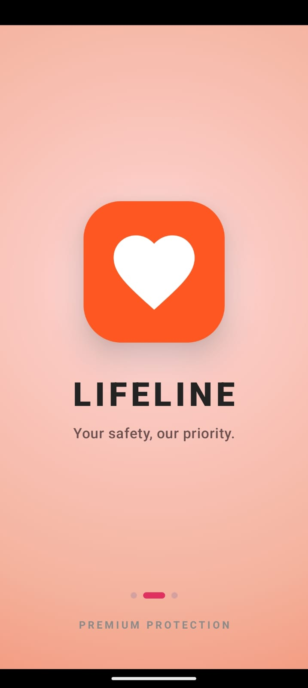
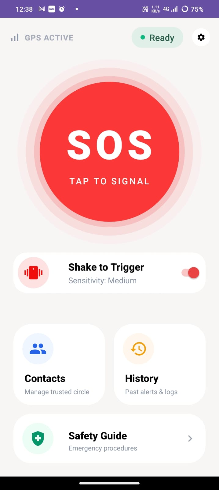
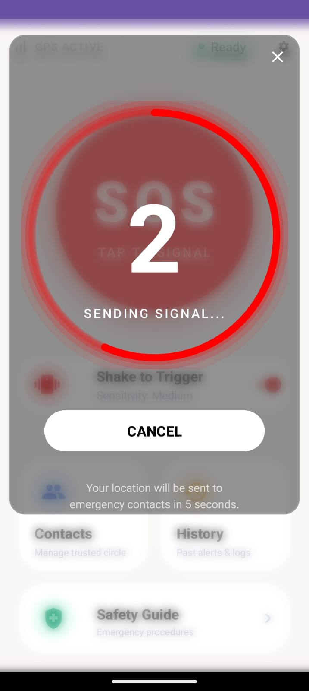
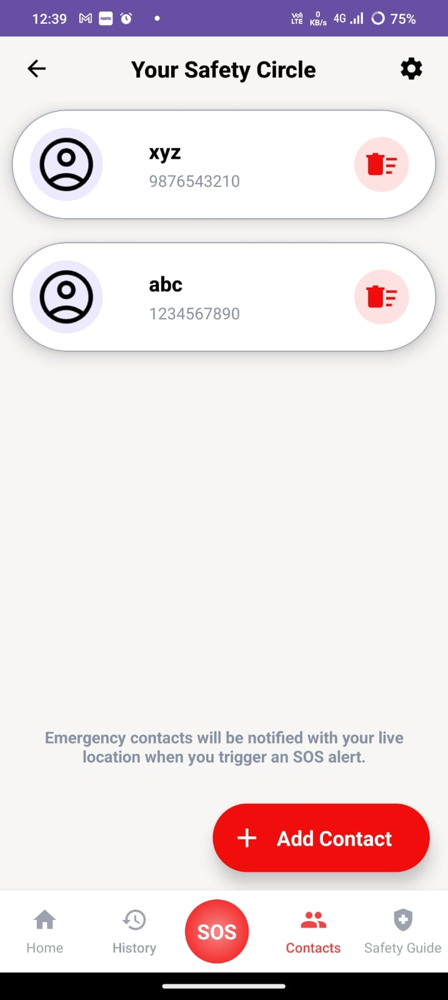
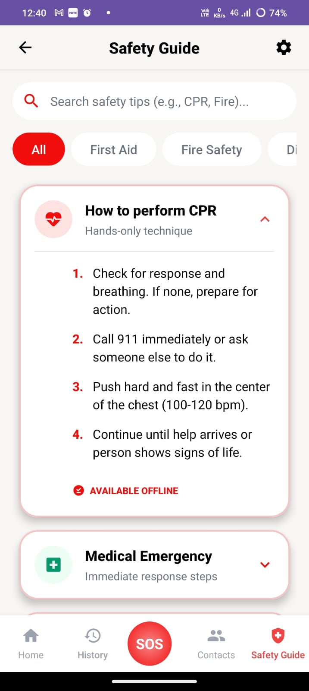
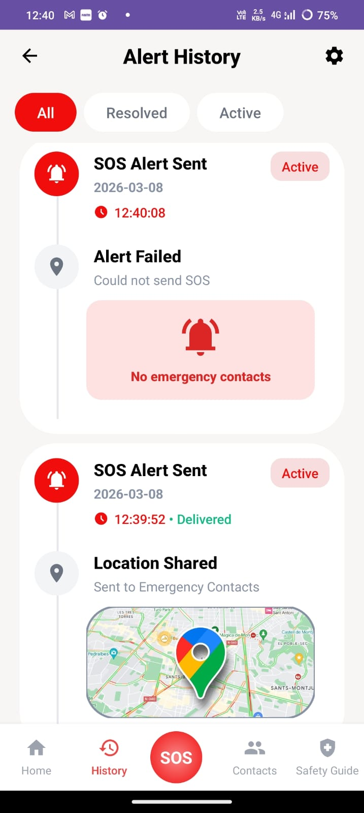
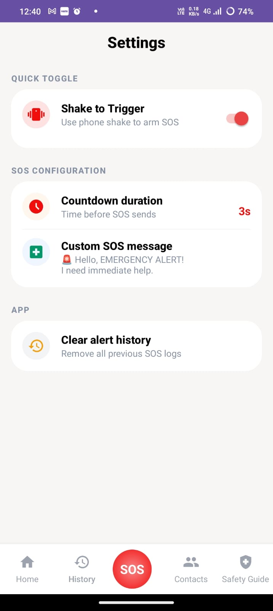

# 🚨 LIFELINE — Personal Emergency Safety App

<p align="center">
  <b>A fully-featured Android emergency safety application that sends your live GPS location to emergency contacts via SMS with a single tap.</b>
</p>

<p align="center">
  
  
  
  
  
  
  
</p>

---

## 📱 Screenshots

| Splash Screen | Home / SOS | SOS Countdown | Safety Circle |
|:---:|:---:|:---:|:---:|
|  |  |  |  |

| Add Contact | Safety Guide | Alert History | Settings |
|:---:|:---:|:---:|:---:|
|  |  |  |  |


---

## 📖 About

**LIFELINE** is a personal emergency safety Android application built as a college micro-project at **M.H. Saboo Siddik Polytechnic**, under the Diploma in Computer Engineering program.

The app solves a real-world problem: in an emergency, people panic and waste precious seconds. LIFELINE eliminates that — one tap of the SOS button fetches your live GPS location and opens your messaging app with all your emergency contacts and a help message pre-filled. Done in under 5 seconds.

---

## ✨ Features

### 🔴 SOS Alert System
- **One-tap SOS button** on the home screen
- **Countdown timer** (3 / 5 / 10 seconds, configurable) — gives time to cancel accidental triggers
- **Fullscreen countdown dialog** with circular progress ring and blurred background effect
- **Shake-to-SOS** — shake the phone twice within 2 seconds to trigger SOS hands-free
- **Long press SOS** — alternative trigger method
- **15-second cooldown** after each trigger to prevent duplicate alerts
- **Haptic feedback** (vibration pattern) when SOS activates

### 📍 Live Location Sharing
- Fetches real-time GPS coordinates using **FusedLocationProviderClient** (Google Play Services)
- Automatically generates a **Google Maps link**: `https://maps.google.com/?q=lat,lng`
- Appended directly to the SOS SMS message
- Graceful fallback if location is unavailable

### 📩 SMS Emergency Alert
- Opens the default messaging app with **all emergency contacts pre-filled**
- Custom SOS message editable from Settings
- Default message: `🚨 EMERGENCY ALERT! I need immediate help.` + location link
- Uses **Android's Intent system** — no external SMS API, no cost, no internet required

### 👥 Emergency Contacts (Safety Circle)
- Add contacts **manually** (name + phone number)
- **Import directly** from the phone's built-in contact list
- Phone number **validation** (10–13 digits)
- **Delete** contacts with a single tap
- Stored locally in **SQLite database** — works completely offline
- All saved contacts notified simultaneously during SOS

### 📋 Alert History
- Full log of every SOS alert triggered
- Records **date**, **time**, and **location link** for each event
- Shows whether alerts were successful or failed
- **Filter tabs** (All / Active / Resolved)
- Clear history option in Settings

### 📚 Safety Guide
- **8 emergency categories** with step-by-step instructions:
  - 🫀 How to Perform CPR
  - 🏥 Medical Emergency Response
  - 🔥 Dealing with a Burn
  - 🚗 Accident Response
  - 🌍 Earthquake Safety (Drop, Cover, Hold On)
  - 😮 Choking Response (Heimlich Maneuver)
  - 🩸 Severe Bleeding Control
  - ⚠️ Harassment / Personal Threat Response
- **Filter by category** (First Aid / Fire Safety / Disaster)
- **Live search** — type to find a guide instantly

### ⚙️ Settings
- Toggle **Shake-to-SOS** on/off
- Customize **SOS countdown duration** (3 / 5 / 10 seconds)
- Edit the **default SOS message**
- **Clear alert history**

---

## 🏗️ Project Structure

```
LIFELINE/
└── app/src/main/
    ├── AndroidManifest.xml
    ├── java/com/lifeline/safety/
    │   ├── activities/
    │   │   ├── SplashActivity.java           # Launcher screen with animations
    │   │   ├── HomeActivity.java             # Main screen — SOS button, shake detection
    │   │   ├── AddContactActivity.java       # Add emergency contact form
    │   │   ├── ViewContactsActivity.java     # Safety circle / contacts list
    │   │   ├── AlertHistoryActivity.java     # SOS alert history log
    │   │   ├── SafetyGuideActivity.java      # Emergency guides with search & filter
    │   │   ├── SafetyDetailActivity.java     # Detailed steps for one guide category
    │   │   └── SettingsActivity.java         # App configuration screen
    │   ├── adapters/
    │   │   ├── ContactAdapter.java           # RecyclerView adapter for contacts list
    │   │   ├── AlertHistoryAdapter.java      # RecyclerView adapter for history list
    │   │   └── SafetyCategoryAdapter.java    # RecyclerView adapter for safety guide
    │   ├── db/
    │   │   └── DatabaseHelper.java           # SQLite — contacts + alert history tables
    │   ├── models/
    │   │   ├── Contact.java                  # Data model: id, name, phone
    │   │   ├── AlertHistory.java             # Data model: id, date, time, location
    │   │   └── SafetyCategory.java           # Data model: title, subtitle, icon, steps
    │   ├── utils/
    │   │   ├── SosEngine.java                # Core SOS orchestrator (brain of the app)
    │   │   ├── SmsHelper.java                # Direct SMS sending via SmsManager
    │   │   ├── LocationHelper.java           # GPS via FusedLocationProviderClient
    │   │   ├── ShakeDetector.java            # Accelerometer shake detection
    │   │   ├── PermissionManager.java        # Runtime permission handling
    │   │   └── CooldownManager.java          # 15-second SOS cooldown lock
    │   └── views/
    │       └── CircularProgressView.java     # Custom Canvas-drawn circular progress ring
    └── res/
        ├── layout/                           # 13 XML layout files
        ├── drawable/                         # 74 vector icons and shape drawables
        ├── values/                           # colors.xml, strings.xml, themes.xml, styles.xml
        └── mipmap/                           # App launcher icons (all screen densities)
```

---

## 🔄 App Flow

```
App Launch
    │
    ▼
SplashActivity ──(2.7 sec animation)──▶ HomeActivity
                                              │
              ┌───────────────────────────────┼────────────────────────┐
              │                               │                        │
              ▼                               ▼                        ▼
  ViewContactsActivity             AlertHistoryActivity       SafetyGuideActivity
              │
              ▼
  AddContactActivity


SOS Trigger Flow:
══════════════════════════════════════════
  User taps SOS button (or shakes phone)
              │
              ▼
  PermissionManager.hasSOSPermissions()?
              │ YES
              ▼
  CountdownDialog shown (5 sec, cancellable)
              │ Not cancelled
              ▼
  SosEngine.triggerSOS()
              │
              ├──▶ LocationHelper.fetchLocation()
              │         └──▶ Google Maps link generated
              │
              ├──▶ DatabaseHelper.insertAlertHistory()
              │
              └──▶ Intent(ACTION_SENDTO, "smsto:contacts")
                        └──▶ Messaging app opens
                                  (contacts + message + location pre-filled)
```

---

## 🛠️ Tech Stack

| Category | Technology |
|---|---|
| Language | Java |
| IDE | Android Studio |
| Minimum SDK | API 28 (Android 9 — Pie) |
| Target SDK | API 36 |
| Build System | Gradle 8.13 with Kotlin Script (KTS) |
| Database | SQLite via `SQLiteOpenHelper` |
| Location | Google Play Services — `FusedLocationProviderClient` |
| UI | Material Design 3, ConstraintLayout, RecyclerView, CardView |
| Sensors | `SensorManager` — `TYPE_ACCELEROMETER` |
| Graphics | `RenderScript` (blur), Custom `Canvas` View |
| Storage | `SharedPreferences` (settings) + SQLite (data) |
| Navigation | Explicit & Implicit Android Intents |

---

## 📦 Dependencies

```toml
# gradle/libs.versions.toml
[versions]
agp              = "8.13.2"
appcompat        = "1.7.1"
material         = "1.13.0"
activity         = "1.12.2"
constraintlayout = "2.2.1"
```

```kotlin
// app/build.gradle.kts
dependencies {
    implementation(libs.appcompat)
    implementation(libs.material)
    implementation(libs.activity)
    implementation(libs.constraintlayout)
    implementation("de.hdodenhof:circleimageview:3.1.0")
    implementation("com.google.android.gms:play-services-location:21.3.0")
}
```

---

## 🚀 Getting Started

### Prerequisites
- **Android Studio** Ladybug (2024.2.1) or newer
- **JDK 11** or higher
- Android device or emulator running **API 28+**
- **Google Play Services** installed on the device/emulator

### Clone & Run

```bash
# 1. Clone the repository
git clone https://github.com/your-username/LIFELINE.git
cd LIFELINE

# 2. Open in Android Studio
#    File → Open → Select the LIFELINE folder

# 3. Let Gradle sync automatically

# 4. Run on device or emulator
#    Click ▶ Run or press Shift + F10
```

### First Launch
1. Grant **Location** permission when prompted
2. Grant **SMS** permission when prompted
3. Add at least one emergency contact from the **Contacts** tab
4. Tap the red **SOS** button to test (you can cancel within the countdown)

---

## 🔐 Permissions

| Permission | Required For |
|---|---|
| `ACCESS_FINE_LOCATION` | Precise GPS coordinates for SOS location link |
| `ACCESS_COARSE_LOCATION` | Fallback network-based location |
| `SEND_SMS` | Sending emergency SMS to contacts |
| `VIBRATE` | Haptic warning pattern when SOS activates |
| `READ_CONTACTS` | Importing contacts from phone's contact book |
| `CAMERA` | *(Future)* Profile photo for emergency contacts |
| `READ_EXTERNAL_STORAGE` | *(Future)* Photo upload for contact profiles |

> 🔒 **Privacy**: All data is stored **locally on the device** using SQLite. No data is sent to any external server. No account or internet connection is required for the core SOS feature.

---

## 🗃️ Database Schema

**Database file:** `lifeline.db` &nbsp;|&nbsp; **Version:** `1`

```sql
-- Emergency Contacts Table
CREATE TABLE EmergencyContacts (
    id    INTEGER PRIMARY KEY AUTOINCREMENT,
    name  TEXT NOT NULL,
    phone TEXT NOT NULL
);

-- Alert History Table
CREATE TABLE AlertHistory (
    id       INTEGER PRIMARY KEY AUTOINCREMENT,
    date     TEXT,
    time     TEXT,
    location TEXT
);
```

---

## 📐 Architecture Overview

```
┌─────────────────────────────────────────────┐
│                  ACTIVITIES                  │  ← UI layer (8 screens)
│  Splash · Home · Contacts · History · Guide  │
└────────────────────┬────────────────────────┘
                     │ calls
┌────────────────────▼────────────────────────┐
│                    UTILS                     │  ← Business logic
│  SosEngine · LocationHelper · SmsHelper      │
│  ShakeDetector · PermissionManager           │
└──────────┬──────────────────┬───────────────┘
           │                  │
┌──────────▼──────┐  ┌────────▼──────────────┐
│   DATABASE      │  │       ADAPTERS         │
│  DatabaseHelper │  │  Contact · History     │
│  (SQLite)       │  │  SafetyCategory        │
└──────────┬──────┘  └────────────────────────┘
           │
┌──────────▼──────┐
│     MODELS      │  ← Plain data classes
│  Contact        │
│  AlertHistory   │
│  SafetyCategory │
└─────────────────┘
```

---

## 🧩 Key Classes

| Class | Role |
|---|---|
| `SosEngine` | Orchestrates the full SOS flow — coordinates location, history, SMS intent |
| `LocationHelper` | Gets GPS via `FusedLocationProviderClient`; generates Google Maps link |
| `ShakeDetector` | Accelerometer listener; triggers after 2 shakes >2.5g within 2 seconds |
| `DatabaseHelper` | Full CRUD for `EmergencyContacts` and `AlertHistory` SQLite tables |
| `PermissionManager` | Handles location + SMS permission requests, rationale, settings redirect |
| `CooldownManager` | Static 15-second lock to prevent duplicate SOS triggers |
| `CircularProgressView` | Custom `View` using `Canvas` + `Paint` to draw the countdown progress arc |

---

## 📋 File Summary

| Category | Count |
|---|---|
| Java source files | 22 |
| XML layout files | 13 |
| Drawable XML files | 74 |
| Values XML files | 6 |
| AndroidManifest.xml | 1 |
| **Grand Total** | **116** |

---

## 👨‍💻 Team

| Name | Roll No | Contribution |
|---|---|---|
| **Zaid Patel** | 230434 | SMS functionality, SosEngine, LocationHelper, Contacts module (AddContactActivity, ViewContactsActivity, ContactAdapter, DatabaseHelper) |
| **Dilbar Shaikh** | — | UI/UX design, XML layouts for all screens, drawable icon assets |
| **Nauman Shaikh** | — | Safety Guide module, SafetyCategoryAdapter, Alert History feature |
| **Hasnain Shaikh** | — | HomeActivity, ShakeDetector, SplashActivity, testing & debugging |

---

## 🏫 Project Info

| Detail | Value |
|---|---|
| Institute | M.H. Saboo Siddik Polytechnic, Mumbai |
| Program | Diploma in Computer Engineering |
| Subject | Mobile Application Development (Android) |
| Project Type | Micro-Project |
| Package Name | `com.lifeline.safety` |
| Version | 1.0 |
| Year | 2024–2025 |

---

## 🔮 Future Scope

- [ ] **Background SOS Service** — trigger even when the screen is locked using a Foreground Service
- [ ] **Auto-call** — automatically call emergency contacts after SOS is triggered
- [ ] **Fake call feature** — simulate an incoming call to escape unsafe situations discreetly
- [ ] **Firebase integration** — real-time location sharing link on a live web dashboard
- [ ] **SOS via notification** — trigger from the notification panel without opening the app
- [ ] **Wear OS support** — trigger SOS from a connected smartwatch
- [ ] **Multi-language support** — Hindi, Urdu, Marathi, and other regional languages
- [ ] **Contact profile photos** — add pictures to emergency contacts
- [ ] **Offline map caching** — store last known location when GPS is unavailable

---

## 📄 License

```
MIT License

Copyright (c) 2025 LIFELINE Project Team — M.H. Saboo Siddik Polytechnic

Permission is hereby granted, free of charge, to any person obtaining a copy
of this software and associated documentation files (the "Software"), to deal
in the Software without restriction, including without limitation the rights
to use, copy, modify, merge, publish, distribute, sublicense, and/or sell
copies of the Software, and to permit persons to whom the Software is
furnished to do so, subject to the following conditions:

The above copyright notice and this permission notice shall be included in all
copies or substantial portions of the Software.

THE SOFTWARE IS PROVIDED "AS IS", WITHOUT WARRANTY OF ANY KIND, EXPRESS OR
IMPLIED, INCLUDING BUT NOT LIMITED TO THE WARRANTIES OF MERCHANTABILITY,
FITNESS FOR A PARTICULAR PURPOSE AND NONINFRINGEMENT. IN NO EVENT SHALL THE
AUTHORS OR COPYRIGHT HOLDERS BE LIABLE FOR ANY CLAIM, DAMAGES OR OTHER
LIABILITY, WHETHER IN AN ACTION OF CONTRACT, TORT OR OTHERWISE, ARISING FROM,
OUT OF OR IN CONNECTION WITH THE SOFTWARE OR THE USE OR OTHER DEALINGS IN THE
SOFTWARE.
```

---

## ⭐ Show Your Support

If this project helped you or you found it interesting, consider giving it a **⭐ star** on GitHub!

---

<p align="center">
  Made with ❤️ by the LIFELINE Team &nbsp;·&nbsp; M.H. Saboo Siddik Polytechnic, Mumbai
</p>
